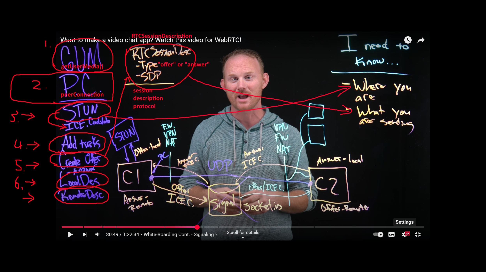

# WebRTC - youtube - Robbert Bunch - webrtc starter

[0:00](https://www.youtube.com/watch?v=g42yNO_dxWQ) - How the video is organized  
[5:00](https://www.youtube.com/watch?v=g42yNO_dxWQ&t=300s) - The. 2 Parts of WebRTC  
[9:20](https://www.youtube.com/watch?v=g42yNO_dxWQ&t=560s) - UDP vs. TCP  

## WHITEBOARDING  
[12:12](https://www.youtube.com/watch?v=g42yNO_dxWQ&t=732s) - [White-boarding the whole process](#white-boarding-the-whole-process)  
[23:25](https://www.youtube.com/watch?v=g42yNO_dxWQ&t=1405s) - White-Boarding Cont. - Signaling  

## SERVER SETUP  
[32:10](https://www.youtube.com/watch?v=g42yNO_dxWQ&t=1930s) - GitHub/Project Instructions  
[35:36](https://www.youtube.com/watch?v=g42yNO_dxWQ&t=2136s) - [Setting Up Local HTTPS](#setting-up-local-https)  
[39:00](https://www.youtube.com/watch?v=g42yNO_dxWQ&t=2340s) - [Running On Local IP](#running-on-local-ip)  
[43:05](https://www.youtube.com/watch?v=g42yNO_dxWQ&t=2585s) - [index.html](#indexhtml)  
[45:24](https://www.youtube.com/watch?v=g42yNO_dxWQ&t=2724s) - [connect to socket.io](#connect-to-socketio)  

## WEBRTC  
[51:03](https://www.youtube.com/watch?v=g42yNO_dxWQ&t=3063s) - [call button](#callbutton) and [fetchUserMedia()](#fetchusermedia)  
[57:04](https://www.youtube.com/watch?v=g42yNO_dxWQ&t=3424s) - createPeerConnection()  
[63:39](https://www.youtube.com/watch?v=g42yNO_dxWQ&t=3819s) - createOffer()  
[66:54](https://www.youtube.com/watch?v=g42yNO_dxWQ&t=4500s) - signaling server gets offer  
[69:50](https://www.youtube.com/watch?v=g42yNO_dxWQ&t=4170s) - client handles newOffer and sends answer   
[74:49](https://www.youtube.com/watch?v=g42yNO_dxWQ&t=4489s) - server handles new answer  
[77:47](https://www.youtube.com/watch?v=g42yNO_dxWQ&t=4667s) - client handles new answer  
[78:40](https://www.youtube.com/watch?v=g42yNO_dxWQ&t=4720s) - ice candidate passing  

---
---

## White-boarding the whole process



## Setting Up Local HTTPS
1. npm install mkcert -g
2. mkcert create-ca
3. mkcert create-cert
4. OPTIONAL: to run it locally, update the files with your local IP
    - if using a phone or another computer (ipconfig to get local ip)

## Running On Local IP
### setup server.js
- create our socket.io server
- add local ip address to cors origins
- also update to connect to local ip address -> see [connect to socket.io](#connect-to-socketio)  

```js
//server.js
const fs = require('fs');
const https = require('https');
const express = require('express');
const app = express();
const socketio = require('socket.io');
app.use(express.static(__dirname)); //handle static files -> tells express that if you find any file in current folder, serve it up (eg. html/css etc)

const key = fs.readFileSync('cert.key'); //get contents
const cert = fs.readFileSync('cert.crt'); //get contents
const expressServer = https.createServer({key, cert}, app);

const io = socketio(expressServer,{
    cors: {
        origin: [
            'https://localhost:8181',
            'https://192.168.1.103:8181' //if using a phone or another computer (ipconfig to get local ip)
        ],
        methods: ["GET", "POST"]
    }
});
```

## talking through the code

### index.html
- starts at 43:09 index.html
    - `<video id="local-video"></video>`
    - `<video id="remote-video"></video>`

- note with: `<script src="/socket.io/socket.io.js"></script>` this is how to include `socket.io.js` when putting it in html
- gives access to `io` in the code eg. `io.connect()`

### socketListeners.js
- `socketListeners.js` - socket related

### server.js
- `server.js` 
    - `const express = require('express');`
    - `const socketio = require('socket.io');`
    - fs module toget contents of cert.key and cert.crt (used for creating the server)
    - cors origin lists valid domains you can visit the server from (NOTE: port NOT included here)
        - https://localhost
        - https://192.168.1.44
    - get access to passed in username + password 

    ```js
    const userName = socket.handshank.auth.userName;
    const password = socket.handshank.auth.password;

    //validate the password
    if(password !== ""){
        socket.disconnect(true);
    }
    ```

### scripts.js
- `scripts.js` - webrtc related

- connect to socket.io
- send userName and password on connecting to socket server
- `localStream` is what we store in localVideoEl
- `remoteStream` is what we store in remoteVideoEl
- `peerConfiguration` - where we put stun servers

```js
// scripts.js

//if trying it on a phone, use this instead...
const socket = io.connect('https://192.168.1.103:8181',{
// const socket = io.connect('https://localhost:8181',{
    auth: {
        userName,password
    }
})

const localVideoEl = document.querySelector('#local-video');
const remoteVideoEl = document.querySelector('#remote-video');

let localStream; //a var to hold the local video stream
let remoteStream; //a var to hold the remote video stream
let peerConnection; //the peerConnection that the two clients use to talk
let didIOffer = false;

let peerConfiguration = {
    iceServers:[
        {
            urls:[
              'stun:stun.l.google.com:19302',
              'stun:stun1.l.google.com:19302'
            ]
        }
    ]
}

const call = async e=>{}
const answerOffer = async(offerObj)=>{}
const addAnswer = async(offerObj)=>{}
const fetchUserMedia = ()=>{}
const createPeerConnection = (offerObj)=>{
    peerConnection.addEventListener("signalingstatechange", (event) => {});
    peerConnection.addEventListener('icecandidate',e=>{});
    peerConnection.addEventListener('track',e=>{});
    if(offerObj){
        //this won't be set when called from call();
        //will be set when we call from answerOffer()
        await peerConnection.setRemoteDescription(offerObj.offer)
    }
}
const addNewIceCandidate = iceCandidate=>{}

document.querySelector('#call').addEventListener('click',call)

```

## detailed functions

### callButton
- `document.querySelector('#call').addEventListener('click',call)`

### fetchUserMedia

- OUTCOME: 
    - `localVideoEl` has video feed 
    - have a stream (`localStream`)

-  `const stream = await navigator.mediaDevices.getUserMedia();` prompts you to use your camera/microphone 
- if user selects "allow"
- then you set: 
    - `localVideoEl.srcObject = stream;`
    - `localStream = stream;`

### createPeerConnection
- call calls createPeerConnection()
    - `const createPeerConnection = (offerObj)=>{}` initial call doesnt send through offerObj (whoever initiates call doesnt send offerObj)
- TODO: create a RTCPeerConnection, it can receive stun servers (see scripts.js when we set `peerConfiguration`)
    - WebRTC -> `peerConnection = await new RTCPeerConnection(peerConfiguration)`

#### create remoteStream and set remoteVideoEl
- TODO: set remoteStream -> create a NEW MediaStream 
    - `remoteStream = new MediaStream();`
- TODO: set remoteVideoEl `remoteVideoEl.srcObject = remoteStream` (html) 
- OUTCOME -> other video feed has loading spinner 

#### add localStream tracks (from GetUserMedia) to peer connection
- TODO: `localStream.getTracks()` for each track,
- TODO: addTrack() adds new media tracks to peerConnection -> ie. associate client1 feed with peerConnection -> `peerConnection.addTrack(track,localStream);`
    - props (track, stream to add it to)

```js
localStream.getTracks().forEach(track=>{
    //add localtracks so that they can be sent once the connection is established
    peerConnection.addTrack(track,localStream);
})

```

#### icecandidate event listener
- `peerConnection.addEventListener('icecandidate',e=>{});`
- triggers because we createPeerConnection() creates `peerConnection = await new RTCPeerConnection(peerConfiguration)` and that returns ice candidates
- if there are ice candidates, send it up to socket server `socket.emit('sendIceCandidateToSignalingServer')`

#### track event listener
- `track` event triggers from other side..
- for each track in stream `remoteStream.addTrack(track, remoteStream)`;
- the remote stream (`remoteStream`) is playing inside `<video id="remote-video">`

#### 
createPeerConnection(offerObj) if you are NOT the call initiator, then it receives offerObj

```js
if(offerObj){
    //this won't be set when called from call();
    //will be set when we call from answerOffer()
    await peerConnection.setRemoteDescription(offerObj.offer)
}
```

### create the offer
- @63min39sec / step5 in taskList.md
- `const offer = await peerConnection.createOffer();`
- `peerConnection.setLocalDescription(offer);`
- set `didIOffer = true;`
- `socket.emit('newOffer',offer);` //send offer to signalingServer

```js
//create offer time!
try{
    console.log("Creating offer...")
    const offer = await peerConnection.createOffer();
    console.log(offer); //sdp + type
    peerConnection.setLocalDescription(offer);
    didIOffer = true;
    socket.emit('newOffer',offer); //send offer to signalingServer
}catch(err){
    console.log(err)
}
```

```js
//scripts.js

//when a client initiates a call
const call = async e=>{
    //@51min03sec
    await fetchUserMedia();

    //peerConnection is all set with our STUN servers sent over
    //@57min04sec
    await createPeerConnection();

    //create offer time!
    try{
        console.log("Creating offer...")
        const offer = await peerConnection.createOffer();
        console.log(offer);
        peerConnection.setLocalDescription(offer);
        didIOffer = true;
        socket.emit('newOffer',offer); //send offer to signalingServer
    }catch(err){
        console.log(err)
    }

}

const fetchUserMedia = ()=>{
    return new Promise(async(resolve, reject)=>{
        try{
            const stream = await navigator.mediaDevices.getUserMedia({
                video: true,
                // audio: true,
            });
            localVideoEl.srcObject = stream;
            localStream = stream;    
            resolve();    
        }catch(err){
            console.log(err);
            reject()
        }
    })
}

const createPeerConnection = (offerObj)=>{
    return new Promise(async(resolve, reject)=>{
        //RTCPeerConnection is the thing that creates the connection
        //we can pass a config object, and that config object can contain stun servers
        //which will fetch us ICE candidates
        peerConnection = await new RTCPeerConnection(peerConfiguration)
        remoteStream = new MediaStream()
        remoteVideoEl.srcObject = remoteStream;


        localStream.getTracks().forEach(track=>{
            //add localtracks so that they can be sent once the connection is established
            peerConnection.addTrack(track,localStream);
        })

        peerConnection.addEventListener("signalingstatechange", (event) => {
            console.log(event);
            console.log(peerConnection.signalingState)
        });

        peerConnection.addEventListener('icecandidate',e=>{
            console.log('........Ice candidate found!......')
            console.log(e)
            if(e.candidate){
                socket.emit('sendIceCandidateToSignalingServer',{
                    iceCandidate: e.candidate,
                    iceUserName: userName,
                    didIOffer,
                })    
            }
        })
        
        peerConnection.addEventListener('track',e=>{
            console.log("Got a track from the other peer!! How excting")
            console.log(e)
            e.streams[0].getTracks().forEach(track=>{
                remoteStream.addTrack(track,remoteStream);
                console.log("Here's an exciting moment... fingers cross")
            })
        })

        if(offerObj){
            //this won't be set when called from call();
            //will be set when we call from answerOffer()
            // console.log(peerConnection.signalingState) //should be stable because no setDesc has been run yet
            await peerConnection.setRemoteDescription(offerObj.offer)
            // console.log(peerConnection.signalingState) //should be have-remote-offer, because client2 has setRemoteDesc on the offer
        }
        resolve();
    })
}
```

## server.js
- `io.on('connection',(socket)=>{})` socket refers to whoever connected
- socket.on('newOffer',newOffer=>{}) we push onto offers an object {}
- initially when we push onto `offers`, we only have `offer`'s value `newOffer`

```js
// server.js
//offers will contain {}
const offers = [
    // offererUserName
    // offer
    // offerIceCandidates
    // answererUserName
    // answer
    // answererIceCandidates
];
const connectedSockets = [
    //username, socketId
]

io.on('connection',(socket)=>{
    socket.on('newOffer',newOffer=>{
        offers.push({
            offererUserName: userName,
            offer: newOffer,
            offerIceCandidates: [],
            answererUserName: null,
            answer: null,
            answererIceCandidates: []
        })

    });
    socket.on('newAnswer',(offerObj,ackFunction)=>{});
    socket.on('sendIceCandidateToSignalingServer',iceCandidateObj=>{});
});
```

### detailed code

```js
//server.js
io.on('connection',(socket)=>{
    // console.log("Someone has connected");
    const userName = socket.handshake.auth.userName;
    const password = socket.handshake.auth.password;

    if(password !== "x"){
        socket.disconnect(true);
        return;
    }
    connectedSockets.push({
        socketId: socket.id,
        userName
    })

    //a new client has joined. If there are any offers available,
    //emit them out
    if(offers.length){
        socket.emit('availableOffers',offers);
    }
    
    socket.on('newOffer',newOffer=>{
        offers.push({
            offererUserName: userName,
            offer: newOffer,
            offerIceCandidates: [],
            answererUserName: null,
            answer: null,
            answererIceCandidates: []
        })
        // console.log(newOffer.sdp.slice(50))
        //send out to all connected sockets EXCEPT the caller
        socket.broadcast.emit('newOfferAwaiting',offers.slice(-1))
    })

    socket.on('newAnswer',(offerObj,ackFunction)=>{
        console.log(offerObj);
        //emit this answer (offerObj) back to CLIENT1
        //in order to do that, we need CLIENT1's socketid
        const socketToAnswer = connectedSockets.find(s=>s.userName === offerObj.offererUserName)
        if(!socketToAnswer){
            console.log("No matching socket")
            return;
        }
        //we found the matching socket, so we can emit to it!
        const socketIdToAnswer = socketToAnswer.socketId;
        //we find the offer to update so we can emit it
        const offerToUpdate = offers.find(o=>o.offererUserName === offerObj.offererUserName)
        if(!offerToUpdate){
            console.log("No OfferToUpdate")
            return;
        }
        //send back to the answerer all the iceCandidates we have already collected
        ackFunction(offerToUpdate.offerIceCandidates);
        offerToUpdate.answer = offerObj.answer
        offerToUpdate.answererUserName = userName
        //socket has a .to() which allows emiting to a "room"
        //every socket has it's own room
        socket.to(socketIdToAnswer).emit('answerResponse',offerToUpdate)
    })

    socket.on('sendIceCandidateToSignalingServer',iceCandidateObj=>{
        const { didIOffer, iceUserName, iceCandidate } = iceCandidateObj;
        // console.log(iceCandidate);
        if(didIOffer){
            //this ice is coming from the offerer. Send to the answerer
            const offerInOffers = offers.find(o=>o.offererUserName === iceUserName);
            if(offerInOffers){
                offerInOffers.offerIceCandidates.push(iceCandidate)
                // 1. When the answerer answers, all existing ice candidates are sent
                // 2. Any candidates that come in after the offer has been answered, will be passed through
                if(offerInOffers.answererUserName){
                    //pass it through to the other socket
                    const socketToSendTo = connectedSockets.find(s=>s.userName === offerInOffers.answererUserName);
                    if(socketToSendTo){
                        socket.to(socketToSendTo.socketId).emit('receivedIceCandidateFromServer',iceCandidate)
                    }else{
                        console.log("Ice candidate recieved but could not find answere")
                    }
                }
            }
        }else{
            //this ice is coming from the answerer. Send to the offerer
            //pass it through to the other socket
            const offerInOffers = offers.find(o=>o.answererUserName === iceUserName);
            const socketToSendTo = connectedSockets.find(s=>s.userName === offerInOffers.offererUserName);
            if(socketToSendTo){
                socket.to(socketToSendTo.socketId).emit('receivedIceCandidateFromServer',iceCandidate)
            }else{
                console.log("Ice candidate recieved but could not find offerer")
            }
        }
        // console.log(offers)
    })

})
```